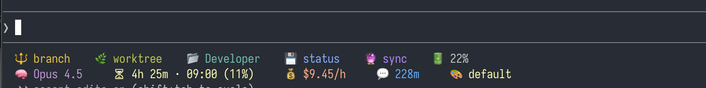

# zstheme

Beautiful statusline themes for [Claude Code](https://claude.ai/claude-code).



## Features

- **6 Built-in Themes** - From minimal to psychedelic
- **Interactive Selector** - Preview themes in real-time
- **Git Integration** - Branch, worktree, file changes, push/pull status
- **Rate Limit Display** - Track API usage with [ccusage](https://github.com/ryoppippi/ccusage)
- **Context Awareness** - Colors change based on context window usage

## Themes

| Theme | Description |
|-------|-------------|
| `2line` | 2line layout with Git info & rate limits |
| `1line` | Compact single line layout |
| `card` | Rounded box with background |
| `bars` | Grouped elements with bar backgrounds |
| `badges` | Individual element badges (default) |
| `lsd-*` | Rainbow colors, psychedelic vibes (easter egg) |

### Theme Combinations

Themes support prefixes and suffixes (60 combinations):

| Modifier | Description |
|----------|-------------|
| (none) | Default colorful theme |
| `mono-` | Monochrome/grayscale |
| `lsd-` | LSD-style color cycling animation |
| `rainbow-` | Rainbow gradient animation |
| `-nerd` | Nerd Font icons (requires Nerd Font) |

**Format:** `[mono-][lsd-|rainbow-]{layout}[-nerd]`

**Examples:**
- `badges` = colorful individual badges
- `mono-bars` = monochrome grouped bars
- `lsd-badges` = LSD animated badges
- `rainbow-2line-nerd` = rainbow animation with Nerd Font icons

## Quick Start

```bash
# Clone the repo
git clone https://github.com/edari-bridge/zstheme.git
cd zstheme

# Install
./install.sh

# Select a theme
zstheme
```

## Installation

### Option 1: Clone & Install (Recommended)

```bash
git clone https://github.com/edari-bridge/zstheme.git ~/.zstheme
cd ~/.zstheme
./install.sh
```

### Option 2: Manual Setup

1. Clone the repository:
   ```bash
   git clone https://github.com/edari-bridge/zstheme.git
   ```

2. Create symlinks:
   ```bash
   ln -s /path/to/zstheme/statusline.sh ~/.claude/statusline.sh
   ln -s /path/to/zstheme/themes ~/.claude/themes
   ```

3. Configure Claude Code (`~/.claude/settings.json`):
   ```json
   {
     "statusLine": {
       "command": "~/.claude/statusline.sh"
     }
   }
   ```

4. Set your theme in `~/.zshrc` or `~/.bashrc`:
   ```bash
   export CLAUDE_THEME="default"
   ```

## Usage

### Interactive Selector

```bash
zstheme
```

Use arrow keys to navigate, see live previews, and press Enter to apply.

### Quick Commands

```bash
zstheme              # Interactive theme selector
zstheme <theme>      # Apply a specific theme
zstheme --list       # List available themes
zstheme --preview    # Preview all themes
zstheme --help       # Show help
```

### Examples

```bash
zstheme 1line       # Switch to compact 1line theme
zstheme lsd-badges   # Enable rainbow mode
zstheme badges       # Individual badge style (default)
zstheme bars         # Grouped bar style
```

## Theme Previews

### 2line
```
🔱 main    🌿 project    📂 src    💾 +2  ~1  -0    🔮 ↑1  ↓0    🔋 35%
🧠 Claude Opus 4.5     ⏳ 2h 30m · 04:00 (42%)     💰 $4.76/h     💬 42m
```

### 1line
```
🔱 main    🌿 project    📂 src    💾 +2  ~1  -0    🔮 ↑1  ↓0    🧠 Opus 4.5    🔋 35%    ⏳ 2h (42%)
```

### card
```
╭ 🔱 main  🌿 project  📂 src  💾 +2 ~1 -0  🔮 ↑1 ↓0  🔋 35% ╮
╰ 🧠 Claude Opus 4.5  ⏳ 2h 30m · 04:00 (42%)  💰 $4.76/h  💬 42m ╯
```

### bars
Groups related elements with background bars:
```
 🔱 main    🌿 project    📂 src     💾 +2  ~1  -0    🔮 ↑1  ↓0     🔋 35%
 🧠 Claude Opus 4.5     ⏳ 2h 30m · 04:00 (42%)     💰 $4.76/h     🎨 bars
```

### badges
Individual badges for each element (default):
```
 🔱 main   🌿 project   📂 src    💾 +2 ~1 -0   🔮 ↑1 ↓0    🔋 35%
 🧠 Opus 4.5   ⏳ 2h·04:00 42%   💬 42m   💰 $4.76/h    🎨 badges
```

## Customization

### Create Your Own Theme

1. Copy an existing theme:
   ```bash
   cp themes/default themes/mytheme
   ```

2. Edit the theme file. Each theme is a bash script with a `render()` function.

3. Available variables in themes:
   - `$MODEL` - Current Claude model
   - `$CONTEXT_PCT` - Context window usage (0-100)
   - `$BRANCH` - Git branch name
   - `$WORKTREE` - Git worktree name
   - `$DIR_NAME` - Current directory name
   - `$GIT_ADDED`, `$GIT_MODIFIED`, `$GIT_DELETED` - File change counts
   - `$GIT_AHEAD`, `$GIT_BEHIND` - Commit difference with remote
   - `$RATE_LIMIT_PCT`, `$RATE_TIME_LEFT`, `$BURN_RATE` - Rate limit info
   - `$SESSION_DURATION_MIN` - Session duration in minutes

### Context-Aware Colors

Themes can change colors based on context usage:
- **< 50%** - Normal colors
- **50-80%** - Warning colors (yellow/orange)
- **> 80%** - Critical colors (red) + 🔥 icon

## Rate Limit Integration

zstheme integrates with [ccusage](https://github.com/ryoppippi/ccusage) for rate limit display:

```bash
npm install -g ccusage
```

Rate limit info is cached for 5 minutes to avoid slowdowns.

## Requirements

- Claude Code CLI
- Bash 4.0+
- [jq](https://stedolan.github.io/jq/) (for installation)
- [ccusage](https://github.com/ryoppippi/ccusage) (optional, for rate limits)

## Uninstall

```bash
cd /path/to/zstheme
./uninstall.sh
```

Or manually:
```bash
rm ~/.claude/statusline.sh
rm ~/.claude/themes
rm ~/.local/bin/zstheme
```

## License

MIT

## Contributing

1. Fork the repository
2. Create a new theme in `themes/`
3. Submit a PR

---

Made with 🎨 for the Claude Code community
